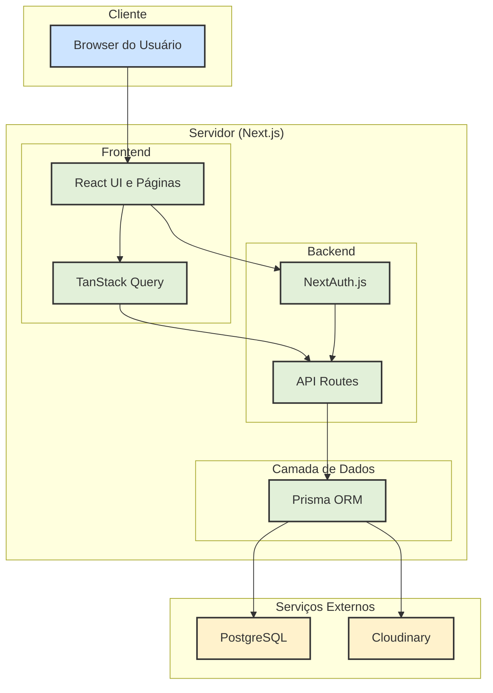
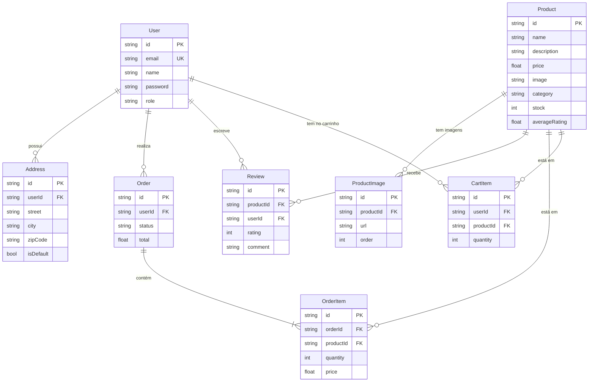
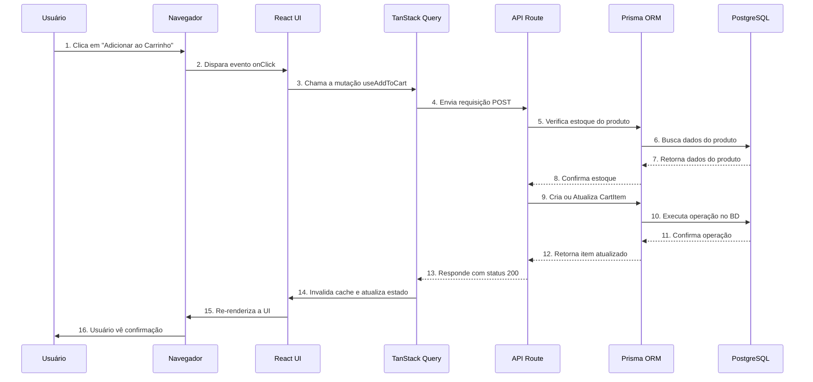
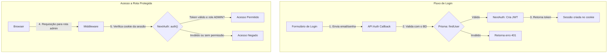

# Guia de Estudo: Arquitetura do Projeto E-Commerce Full-Stack

Este documento serve como um guia de estudo detalhado da arquitetura e das tecnologias utilizadas no projeto de e-commerce. O objetivo é fornecer a estudantes de programação uma visão clara de como um aplicativo web moderno é construído, desde o frontend até o banco de dados.

---

## 1. Visão Geral da Arquitetura

A aplicação segue uma arquitetura **Full-Stack Monorepo** utilizando **Next.js**, onde o código do frontend e do backend coexistem no mesmo projeto. Isso simplifica o desenvolvimento e o deploy.



| Camada                                | Tecnologia Principal | Responsabilidade                                                                             |
| :------------------------------------ | :------------------- | :------------------------------------------------------------------------------------------- |
| **Interface (UI)**                    | React / Next.js      | Renderizar a interface do usuário, gerenciar a navegação e interações.                       |
| **Gerenciamento de Dados (Frontend)** | TanStack Query       | Orquestrar a busca de dados (fetching), cache e atualizações assíncronas.                    |
| **Backend (API)**                     | Next.js API Routes   | Servir como o ponto de entrada para todas as requisições, contendo a lógica de negócio.      |
| **Autenticação**                      | NextAuth.js          | Gerenciar sessões de usuário, login, registro e controle de acesso (roles).                  |
| **Acesso ao Banco de Dados (ORM)**    | Prisma               | Fornecer uma interface segura e de tipagem forte para comunicar com o banco de dados.        |
| **Banco de Dados**                    | PostgreSQL           | Armazenar de forma persistente todos os dados da aplicação (usuários, produtos, pedidos).    |
| **Armazenamento de Mídia**            | Cloudinary           | Hospedar, otimizar e entregar as imagens dos produtos.                                       |
| **Testes End-to-End**                 | Playwright           | Simular o comportamento do usuário para garantir que todos os fluxos funcionem corretamente. |

---

## 2. Banco de Dados: Entidades e Relacionamentos (ERD)

O diagrama abaixo (ERD) modela a estrutura do nosso banco de dados. Cada "caixa" é uma tabela e as linhas representam como elas se conectam.



### Explicação das Entidades para Estudantes:

- **User**: Armazena informações de login e o `role` (papel), que define se o usuário é um cliente, administrador ou super administrador.
- **Address**: Guarda os endereços de um usuário. Um usuário pode ter vários endereços.
- **Product**: O coração do e-commerce. Contém todos os detalhes do produto, incluindo o `image` (link para a imagem principal no Cloudinary) e `averageRating` (nota média das avaliações).
- **ProductImage**: Permite que um produto tenha uma galeria de imagens, e não apenas uma.
- **Review**: Avaliações (nota e comentário) que um `User` faz para um `Product`.
- **Order**: Representa um pedido feito por um `User`. Contém o status e o valor total.
- **OrderItem**: Item específico dentro de um `Order`. Ele "congela" o preço do produto no momento da compra.
- **CartItem**: Representa um item que o usuário adicionou ao carrinho, mas ainda não comprou.

---

## 3. Fluxo de Dados Detalhado: Adicionar ao Carrinho

Para entender como as tecnologias se conectam, vamos analisar o fluxo de um usuário adicionando um produto ao carrinho.



### Dicas para Estudantes:

- **Fluxo Otimista (Optimistic UI)**: Com TanStack Query, poderíamos atualizar a UI _antes_ mesmo da API responder (passo 15 antes do 4). Se a API falhar, o TanStack Query reverte a alteração. Isso torna a experiência do usuário instantânea.
- **Separação de Responsabilidades**: Note como cada parte tem seu papel. O React cuida da tela, o TanStack Query da comunicação, a API da lógica de negócio e o Prisma/PostgreSQL dos dados.
- **Segurança**: A API Route é a única que fala com o banco de dados. O frontend nunca tem acesso direto, garantindo a segurança.

---

## 4. Autenticação e Autorização com NextAuth.js

A segurança é crucial. O NextAuth.js gerencia quem pode acessar o quê.



### Pontos-Chave para Estudantes:

- **JWT (JSON Web Token)**: É um "passaporte" digital seguro que o backend gera para o usuário após o login. A cada requisição, o usuário apresenta esse passaporte para provar quem é.
- **Middleware**: É uma camada que intercepta todas as requisições antes de chegarem à API. É o local ideal para verificar se o usuário está logado e se tem permissão para acessar um recurso.
- **Roles (Papéis)**: O `enum UserRole` no `schema.prisma` é a base da autorização. Rotas de administrador verificam se `session.user.role` é `ADMIN` ou `SUPER_ADMIN`.

---

## 5. Testes End-to-End com Playwright

Testes garantem que a aplicação funcione como esperado do ponto de vista do usuário.

**O que o Playwright faz?**
Ele abre um navegador real (invisível), executa uma série de ações (como se fosse um usuário) e verifica se os resultados na tela são os esperados.

**Exemplo de Teste: Login com Falha**
Este teste verifica se uma mensagem de erro aparece ao tentar logar com credenciais inválidas.

```typescript
// tests/auth.spec.ts

import { test, expect } from '@playwright/test';

test('should display error message on failed login', async ({ page }) => {
  // 1. Navega para a página de login
  await page.goto('/login');

  // 2. Preenche o formulário com dados inválidos
  await page.fill('input[name="email"]', 'wrong@example.com');
  await page.fill('input[name="password"]', 'wrongpassword');

  // 3. Clica no botão de login
  await page.click('button:has-text("Sign In")');

  // 4. Verifica se a mensagem de erro está visível
  const errorMessage = page.getByRole('alert');
  await expect(errorMessage).toBeVisible();
  await expect(errorMessage).toContainText('Invalid credentials');
});
```

### Dicas para Estudantes:

- **Por que E2E?**: Testes unitários verificam pequenas partes do código isoladamente. Testes E2E (End-to-End) verificam se todas as partes (frontend, backend, banco de dados) funcionam **juntas**.
- **Seletores Robustos**: Usar `getByRole('alert')` é melhor do que usar seletores de CSS como `#error-message`, pois testa a acessibilidade e é mais resistente a mudanças de estilo.

---

## 6. Conclusão: Principais Conceitos para Aprender com Este Projeto

1.  **Arquitetura Full-Stack com Next.js**: Entenda os benefícios de ter frontend e backend no mesmo projeto e como o App Router organiza as páginas e APIs.
2.  **Tipagem Forte de Ponta a Ponta**: TypeScript no frontend, backend e com o Prisma garante menos bugs e um desenvolvimento mais seguro.
3.  **Abstração do Banco de Dados com ORM**: O Prisma permite que você trabalhe com o banco de dados usando objetos TypeScript, sem precisar escrever SQL manualmente na maior parte do tempo.
4.  **Gerenciamento de Estado Moderno**: TanStack Query simplifica a lógica de loading, erros e cache, tornando a UI mais reativa e eficiente.
5.  **Autenticação Baseada em Tokens**: Aprenda como o NextAuth.js facilita a implementação de um sistema de autenticação seguro e escalável.
6.  **Importância dos Testes Automatizados**: Veja como os testes E2E com Playwright dão confiança para fazer alterações no código sem quebrar funcionalidades existentes.
7.  **Uso de Serviços Externos**: Entenda por que delegar tarefas como armazenamento de imagens (Cloudinary) é uma prática recomendada em aplicações web.
