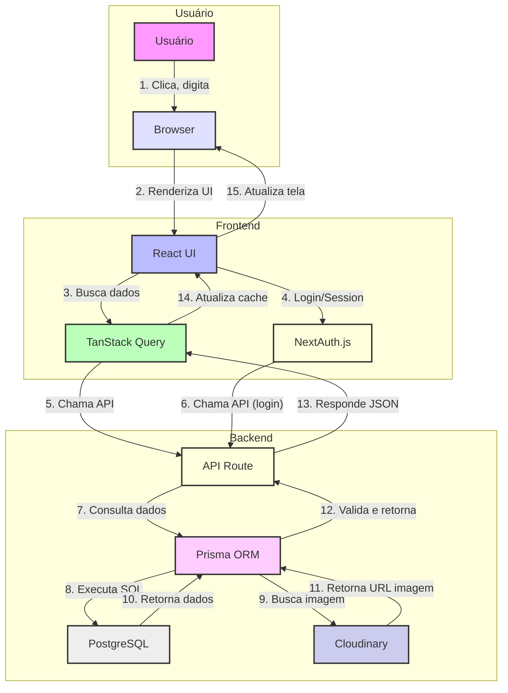
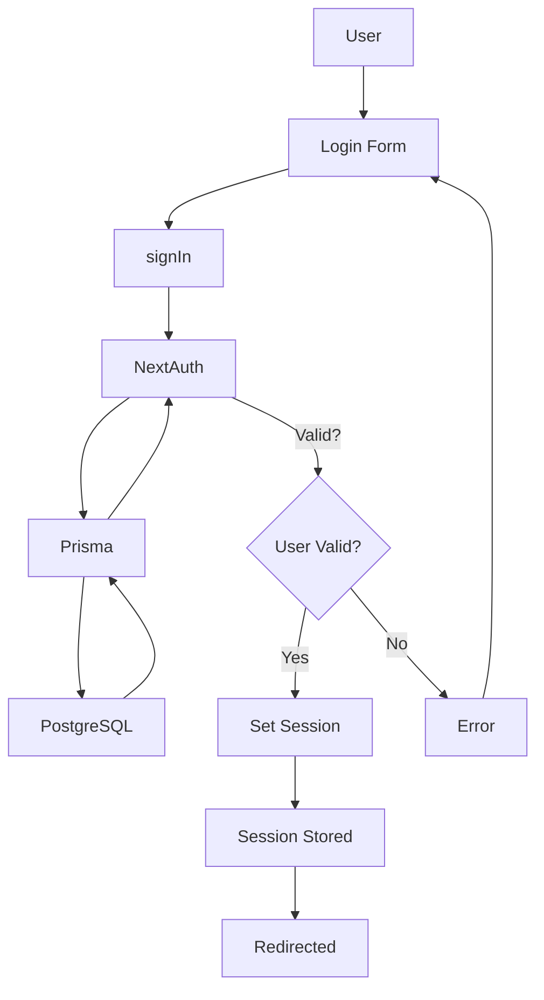
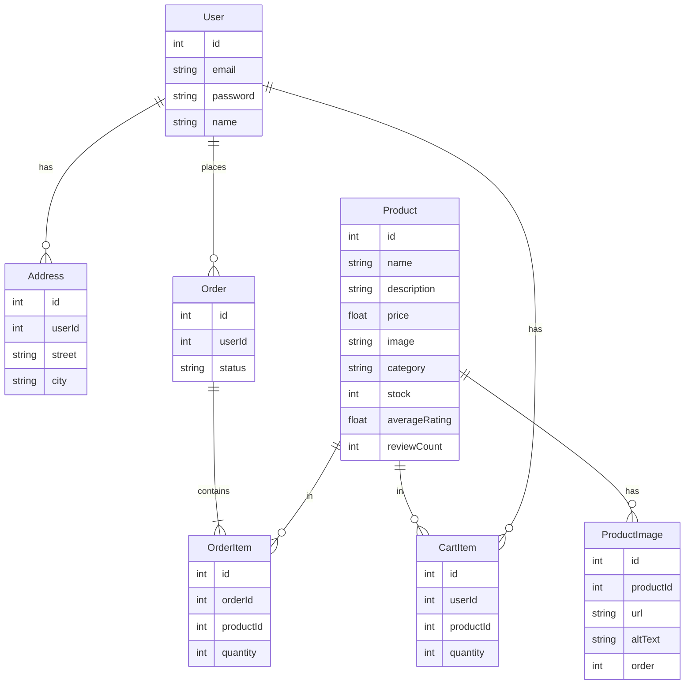
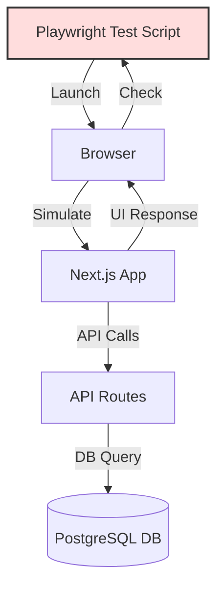
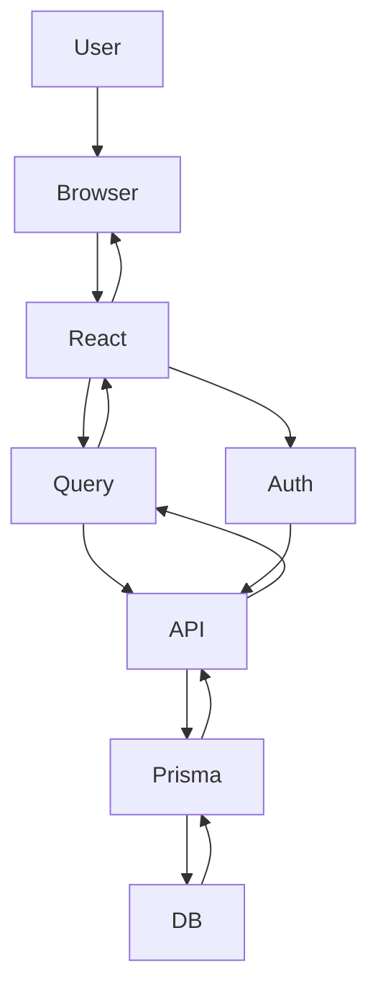

# E-Commerce Project: Architecture & Technology Overview

## 1. Project Structure Overview

```
/ (root)
├── src/
│   ├── app/           # Next.js app directory (pages, API routes)
│   ├── components/    # React UI components
│   ├── lib/           # Utility functions
│   └── ...
├── prisma/            # Prisma schema and seed
├── tests/             # Playwright E2E and edge case tests
├── package.json       # Project dependencies and scripts
└── ...
```

---

## 2. Technology Stack & Integration

| Layer           | Technology          | Purpose/Integration                                                                               |
| --------------- | ------------------- | ------------------------------------------------------------------------------------------------- |
| **Frontend**    | React (Next.js)     | UI, routing, SSR/SSG, API routes. Provides the user interface and navigation.                     |
| **State/Fetch** | TanStack Query      | Data fetching, caching, React Suspense integration. Ensures efficient and consistent data access. |
| **Auth**        | NextAuth.js         | Authentication, session management. Handles login, registration, and session cookies.             |
| **Backend API** | Next.js API routes  | Handles business logic, connects to DB. All data and auth requests go through these endpoints.    |
| **ORM/DB**      | Prisma + PostgreSQL | Database access, migrations, seeding. Prisma provides a type-safe interface to the database.      |
| **Testing**     | Playwright          | E2E, edge case, and robustness tests. Simulates real user flows and checks for regressions.       |

**Integration Explanation:**

- The frontend (React/Next.js) renders UI and calls API routes for data and actions.
- TanStack Query manages all data fetching and caching, and integrates with React Suspense for smooth loading states.
- NextAuth.js provides secure authentication and session management, using Prisma to store user data in PostgreSQL.
- All backend logic (including auth) is handled in Next.js API routes, which use Prisma to interact with the database.
- Playwright tests run against the full stack, simulating real user actions and verifying both frontend and backend behavior.

---

## 3. Data Flow: Frontend ↔ Backend (Profissional e Didático)



### Legenda do Fluxo (Passo a Passo)

1. **Usuário**: Interage com a aplicação (cliques, digitação, envio de formulários).
2. **Browser**: Renderiza a interface React.
3. **React UI**: Solicita dados via TanStack Query ou autenticação via NextAuth.js.
4. **TanStack Query**: Realiza requisições para API REST.
5. **NextAuth.js**: Gerencia login, sessão e autenticação.
6. **API Route**: Recebe requisições do frontend, executa lógica de negócio.
7. **Prisma ORM**: Traduz requisições em comandos SQL para o banco de dados.
8. **Prisma ORM**: Busca URLs de imagens no Cloudinary quando necessário.
9. **Banco de Dados**: Retorna dados solicitados para o Prisma.
10. **Cloudinary**: Retorna URLs das imagens dos produtos.
11. **Prisma ORM**: Valida dados e retorna para a API.
12. **API Route**: Responde ao frontend com dados em formato JSON.
13. **TanStack Query**: Atualiza cache local e repassa dados para a UI.
14. **React UI**: Atualiza a tela do usuário instantaneamente.

### Dicas para Estudantes

- Cada etapa é separada para facilitar manutenção e testes.
- O uso de cache (TanStack Query) evita requisições desnecessárias.
- O backend (API + ORM) garante segurança e integridade dos dados.
- O fluxo é assíncrono: cada etapa só avança quando a anterior termina.

---

## 4. Authentication Flow (Login)



**Step-by-step Explanation:**

1. User fills out the login form and submits.
2. The form calls `signIn('credentials')` from NextAuth.js.
3. NextAuth.js API route receives the credentials and uses Prisma to check the database.
4. If the user is valid, a session cookie is set and the user is redirected to the app.
5. If invalid, an error is shown in the UI.

**Key Points for Students:**

- NextAuth.js abstracts away most session/cookie logic.
- Prisma ensures secure, type-safe DB access.

---

erDiagram

## 5. Database: Entities & Relationships (ERD)



**Entity Relationship Explanation:**

- **User**: Can have many orders, addresses, and cart items.
- **Order**: Belongs to a user, contains many order items.
- **OrderItem**: Connects orders and products, tracks quantity.
- **CartItem**: Tracks products in a user's cart.
- **Address**: Stores user shipping/billing addresses.
- **Product**: Can be in many order items and cart items. Possui os campos:

  - `name`: nome do produto
  - `description`: descrição detalhada
  - `price`: preço
  - `image`: URL da imagem principal (armazenada no Cloudinary)
  - `category`: categoria
  - `stock`: quantidade em estoque
  - `averageRating`: média das avaliações dos usuários
  - `reviewCount`: número total de avaliações

- **ProductImage**: Permite múltiplas imagens por produto (galeria). Campos:
  - `url`: endereço da imagem na nuvem
  - `altText`: texto alternativo para acessibilidade
  - `order`: ordem de exibição na galeria

**Para estudantes:**

- O diagrama agora mostra todos os campos essenciais do produto, incluindo campos de avaliação e galeria de imagens, tornando o modelo mais próximo do que é usado em projetos reais.
- Sempre confira se os campos do diagrama refletem o que é usado no código, na interface do usuário e nas funcionalidades avançadas (como avaliações e galeria).

### Serviço de Imagens: Cloudinary

No projeto, as imagens dos produtos não são armazenadas diretamente no banco de dados, mas sim em um serviço externo chamado **Cloudinary**. O campo `image` da entidade Product guarda a URL da imagem hospedada na nuvem.

- **Como funciona:**

  - Quando um administrador faz upload de uma imagem de produto, o arquivo é enviado para o Cloudinary via API.
  - O Cloudinary armazena a imagem, aplica otimizações (tamanho, qualidade, formato) e retorna uma URL segura.
  - Essa URL é salva no campo `image` do produto no banco de dados.
  - O frontend utiliza essa URL para exibir a imagem do produto em todas as páginas (loja, admin, carrinho, etc).

- **Vantagens do Cloudinary:**
  - Armazenamento escalável e seguro para imagens.
  - Otimização automática para web (compressão, formatos modernos).
  - URLs públicas e protegidas para fácil integração.
  - Permite múltiplas imagens por produto (campo adicional `ProductImage` para galeria, se necessário).

**Para estudantes:**

- O uso de um serviço externo de imagens é uma prática comum em projetos modernos, pois facilita a gestão, otimização e entrega de arquivos estáticos sem sobrecarregar o banco de dados.
- Sempre que ver um campo `image` ou galeria de imagens, lembre-se que o arquivo está na nuvem e o banco só guarda o link.

---

## 6. Testing: Playwright E2E (End-to-End)

**Test Types:**

- Edge cases (invalid login, registration, admin access, etc)
- Authenticated flows (cart, checkout, etc)

**How Playwright Works (Step-by-Step):**

1. **Test script** launches a real browser (Chromium, Firefox, WebKit).
2. **Simulates user actions**: navigation, clicks, form fills, etc.
3. **Waits for UI elements** to appear, checks for correct navigation, error messages, and UI state.
4. **Uses robust selectors and explicit waits** to handle async UI/data.
5. **Reports pass/fail** for each scenario, with screenshots and logs for failures.

**Example Test:**

```ts
await page.goto('/login');
await page.fill('input[name="email"]', 'test@example.com');
await page.click('button:has-text("Sign in")');
await expect(page.getByRole('alert')).toBeVisible();
```

**Testing Flow Diagram:**



**For Students:**

- Playwright tests the entire stack, from UI to backend and database, as a real user would experience it.
- E2E tests are essential for catching bugs that only appear when all parts of the app work together.

---

## 7. How Technologies Integrate

- **Next.js**: The core framework, providing both the frontend (React UI, routing, SSR/SSG) and backend (API routes for business logic and data access) in a single codebase.
- **TanStack Query**: Handles all data fetching and caching in the frontend, making API calls to Next.js API routes and integrating with React Suspense for smooth loading and error states.
- **NextAuth.js**: Manages authentication and session, using Prisma to store and validate users in the database. Integrates seamlessly with Next.js API routes.
- **Prisma**: The ORM layer, providing type-safe access to the PostgreSQL database for both business logic (API routes) and authentication (NextAuth.js).
- **Playwright**: Runs end-to-end tests, simulating real user flows and verifying that the entire stack (UI, API, DB) works as expected.

**Comprehensive Integration Flow:**

1. User interacts with the React UI (Next.js frontend).
2. UI uses TanStack Query to fetch/mutate data via API routes.
3. API routes use Prisma to read/write data in PostgreSQL.
4. NextAuth.js handles login/session, also using Prisma.
5. Playwright tests simulate all flows, ensuring reliability.

---

## 8. Fullstack Architecture Diagram (Annotated)



**Detailed Explanation for Students:**

- **User**: Interacts with the app via the browser (clicks, types, submits forms).
- **Browser**: Renders the React UI, receives updates from the app.
- **React Components**: Build the UI, handle user input, and display data.
- **TanStack Query**: Handles all data fetching, caching, and background updates for the UI.
- **NextAuth.js**: Manages authentication and session, making sure users are logged in securely.
- **Next.js API Routes**: The backend logic, handling requests from the frontend and returning data or errors.
- **Prisma ORM**: Provides a type-safe way to access and validate data in the database.
- **PostgreSQL**: The relational database where all persistent data is stored.

---

## 9. Key Points for Web Coding Students

- **Separation of Concerns**: Each technology has a clear role (UI, data, API, DB, auth, testing).
- **Type Safety & Security**: Prisma and NextAuth.js ensure data is validated and users are authenticated securely.
- **Modern Data Fetching**: TanStack Query and React Suspense provide a smooth, modern UX for loading and error states.
- **Fullstack Testing**: Playwright simulates real user flows, ensuring the whole stack works together.
- **Scalability**: This architecture can grow with your app, supporting more features and users.
- **Developer Experience**: Next.js, Prisma, and Playwright all provide great DX, with type safety, hot reload, and fast feedback.

---

_For more, see the codebase and Playwright test files for real-world examples and practical usage. Diagrams are editable and can be used for presentations or further study._
