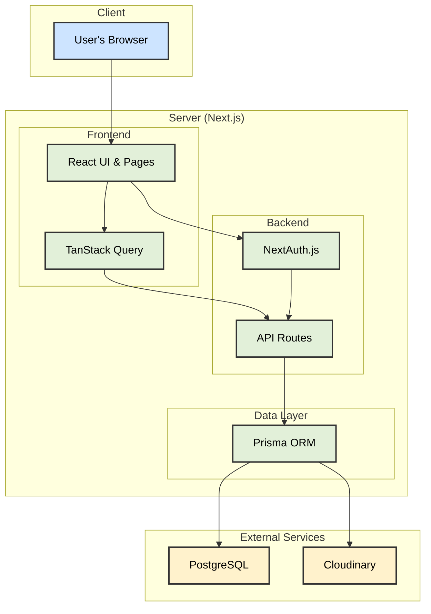
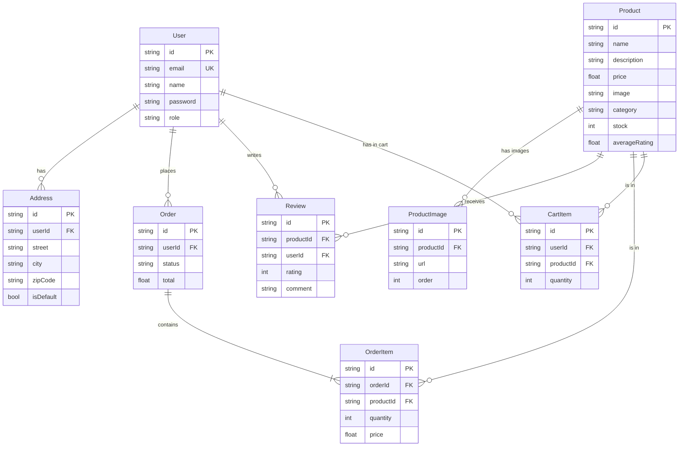
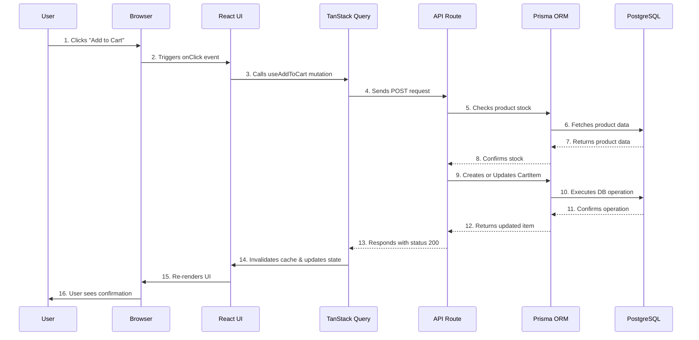
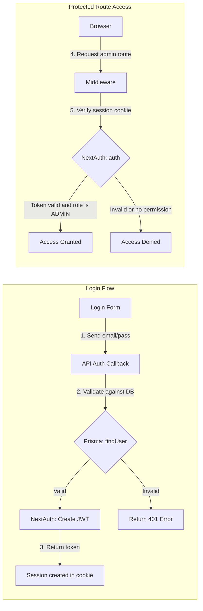

# Study Guide: Full-Stack E-Commerce Project Architecture

This document serves as a detailed study guide for the architecture and technologies used in this e-commerce project. The goal is to provide programming students with a clear view of how a modern web application is built, from the frontend to the database.

---

## 1. Architecture Overview

The application follows a **Full-Stack Monorepo** architecture using **Next.js**, where the frontend and backend code coexist in the same project. This simplifies development and deployment.



| Layer                          | Main Technology    | Responsibility                                                         |
| :----------------------------- | :----------------- | :--------------------------------------------------------------------- |
| **Interface (UI)**             | React / Next.js    | Render the user interface, manage navigation and interactions.         |
| **Data Management (Frontend)** | TanStack Query     | Orchestrate data fetching, caching, and asynchronous updates.          |
| **Backend (API)**              | Next.js API Routes | Serve as the entry point for all requests, containing business logic.  |
| **Authentication**             | NextAuth.js        | Manage user sessions, login, registration, and access control (roles). |
| **Database Access (ORM)**      | Prisma             | Provide a type-safe interface to communicate with the database.        |
| **Database**                   | PostgreSQL         | Persistently store all application data (users, products, orders).     |
| **Media Storage**              | Cloudinary         | Host, optimize, and deliver product images.                            |
| **End-to-End Tests**           | Playwright         | Simulate user behavior to ensure all flows work correctly.             |

---

## 2. Database: Entity-Relationship Diagram (ERD)

The diagram below (ERD) models our database structure. Each "box" is a table, and the lines represent how they connect.



### Entity Explanation for Students:

- **User**: Stores login information and the `role`, which defines if the user is a customer, admin, or super admin.
- **Address**: Holds a user's addresses. A user can have multiple addresses.
- **Product**: The heart of the e-commerce. Contains all product details, including the `image` (link to the main image on Cloudinary) and `averageRating`.
- **ProductImage**: Allows a product to have a gallery of images, not just one.
- **Review**: Ratings (score and comment) that a `User` gives to a `Product`.
- **Order**: Represents an order placed by a `User`. Contains the status and total amount.
- **OrderItem**: A specific item within an `Order`. It "freezes" the product's price at the time of purchase.
- **CartItem**: Represents an item that a user has added to the cart but has not yet purchased.

---

## 3. Detailed Data Flow: Add to Cart

To understand how the technologies connect, let's analyze the flow of a user adding a product to their cart.



### Tips for Students:

- **Optimistic UI**: With TanStack Query, we could update the UI _before_ the API even responds (step 15 before 4). If the API fails, TanStack Query reverts the change. This makes the user experience feel instantaneous.
- **Separation of Concerns**: Notice how each part has its role. React handles the screen, TanStack Query handles communication, the API handles business logic, and Prisma/PostgreSQL handle the data.
- **Security**: The API Route is the only part that talks to the database. The frontend never has direct access, ensuring security.

---

## 4. Authentication and Authorization with NextAuth.js

Security is crucial. NextAuth.js manages who can access what.



### Key Points for Students:

- **JWT (JSON Web Token)**: It's a secure digital "passport" that the backend generates for the user after login. With each request, the user presents this passport to prove who they are.
- **Middleware**: It's a layer that intercepts requests before they reach the API. It's the ideal place to check if a user is logged in and has permission to access a resource.
- **Roles**: The `UserRole` enum in `schema.prisma` is the foundation of authorization. Admin routes check if `session.user.role` is `ADMIN` or `SUPER_ADMIN`.

---

## 5. End-to-End Testing with Playwright

Tests ensure the application works as expected from the user's point of view.

**What does Playwright do?**
It opens a real (headless) browser, performs a series of actions (just like a user would), and checks if the results on the screen are as expected.

**Example Test: Failed Login**
This test checks if an error message appears when trying to log in with invalid credentials.

```typescript
// tests/auth.spec.ts

import { test, expect } from '@playwright/test';

test('should display error message on failed login', async ({ page }) => {
  // 1. Navigate to the login page
  await page.goto('/login');

  // 2. Fill the form with invalid data
  await page.fill('input[name="email"]', 'wrong@example.com');
  await page.fill('input[name="password"]', 'wrongpassword');

  // 3. Click the login button
  await page.click('button:has-text("Sign In")');

  // 4. Check if the error message is visible
  const errorMessage = page.getByRole('alert');
  await expect(errorMessage).toBeVisible();
  await expect(errorMessage).toContainText('Invalid credentials');
});
```

### Tips for Students:

- **Why E2E?**: Unit tests check small parts of the code in isolation. E2E (End-to-End) tests check if all the parts (frontend, backend, database) work **together**.
- **Robust Selectors**: Using `getByRole('alert')` is better than using CSS selectors like `#error-message` because it tests for accessibility and is more resilient to style changes.

---

## 6. Conclusion: Key Concepts to Learn from This Project

1.  **Full-Stack Architecture with Next.js**: Understand the benefits of having frontend and backend in the same project and how the App Router organizes pages and APIs.
2.  **End-to-End Type Safety**: TypeScript on the frontend, backend, and with Prisma ensures fewer bugs and a safer development experience.
3.  **Database Abstraction with an ORM**: Prisma allows you to work with your database using TypeScript objects, mostly avoiding the need to write raw SQL.
4.  **Modern State Management**: TanStack Query simplifies loading, error, and caching logic, making the UI more reactive and efficient.
5.  **Token-Based Authentication**: Learn how NextAuth.js facilitates the implementation of a secure and scalable authentication system.
6.  **Importance of Automated Testing**: See how E2E tests with Playwright provide confidence to make changes to the code without breaking existing features.
7.  **Use of External Services**: Understand why delegating tasks like image storage (Cloudinary) is a recommended practice in web applications.
